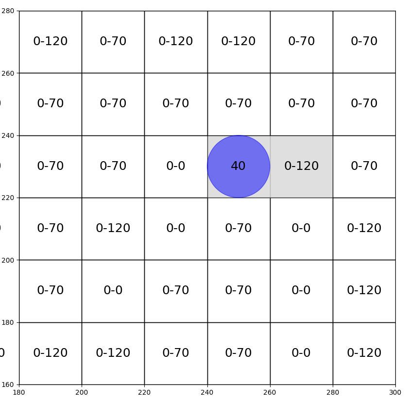

# GridDrive

GridDrive is a new [Gym](https://github.com/openai/gym) environment you can use for testing Reinforcement Learning algorithms on simple navigation tasks.
This code has been used also in the paper
> ["Explanation-Aware Experience Replay in Rule-Dense Environments"](https://arxiv.org/abs/2109.14711)

## Usage

The following snippet of code (available also [here](debug_environment.py)) shows how to run an instance of GridDrive with a random policy.

```
import time
from grid_drive import GridDrive

env = GridDrive(culture_level="Easy", partial_observability=True)

def run_one_episode (env):
	env.seed(38)
	env.reset()
	sum_reward = 0
	done = False
	while not done:
		action = env.action_space.sample()
		state, reward, done, info = env.step(action)
		sum_reward += reward
		env.render()
		time.sleep(0.25)
	return sum_reward

sum_reward = run_one_episode(env)
```

## Installation
This project has been tested on Debian 9 and macOS Mojave 10.14 with Python 3.7.9 and 3.8.6. 
The script [setup.sh](setup.sh) can be used to install GridDrive and and the environments in a python3 virtualenv.

Before being able to run the [setup.sh](setup.sh) script you have to install: virtualenv, python3-dev, python3-pip and make. 

## Description
GridDrive is a 15×15 grid of cells, where every cell represents a different type of road (see Figure 2, left), with base types (e.g. motorway, school road, city) combined with other modifiers (roadworks, accidents, weather). 
Each vehicle will have a set of properties that define which type of vehicle they are (emergency, civilian, worker, etc). 

Complex combinations of these properties will define a strict speed limit for each cell, according to a culture (a particular type of argumentation framework).
Indeed, the goal of this environment is to test the behaviour of RL algorithms when increasing the complexity (i.e. number of exceptions) of the regulation/culture governing the environment.
We defined 3 different types of regulations:
- **Easy**: The Easy regulation is the simplest, with the lowest amount of rules and exceptions to them.
- **Medium**: The Medium regulation is more complex than Easy, with the more rules and exceptions to them.
- **Hard**: The Hard regulation is the most complex.

In GridDrive, the goal of the agent is to visit as much cells as possible, as fast as possible.
The reward function is as follows:
- A -1 terminal reward is given whenever the agent violates the underlying regulation.
- A null reward (+0) is given whenever the agent visits an old cell.
- Otherwise, if it visits a new cell without violating the regulation, the agent gets a reward equal to its speed normalised in (0,1].

The Gym constructor takes as input two parameters:
- culture_level: it can be either 'Easy', 'Medium' or 'Hard'.
- partial_observability: it can be either True or False.

*Environment Description*


*Screenshot of GridDrive*


**How to read the screenshot of GridDrive**: The purple circle is the car and its speed (in [0,120]) inside it. Grey cells are already explored cells.

## Citation
This code is free. So, if you use this code anywhere, please cite us:
```
@article{sovrano2021explanation,
  title={Explanation-Aware Experience Replay in Rule-Dense Environments},
  author={Sovrano, Francesco and Raymond, Alex and Prorok, Amanda},
  journal={IEEE Robotics and Automation Letters},
  volume={7},
  number={2},
  pages={898--905},
  year={2021},
  publisher={IEEE}
}
```

Thank you!

## Support
For any problem or question please contact me at `cesco.sovrano@gmail.com`
